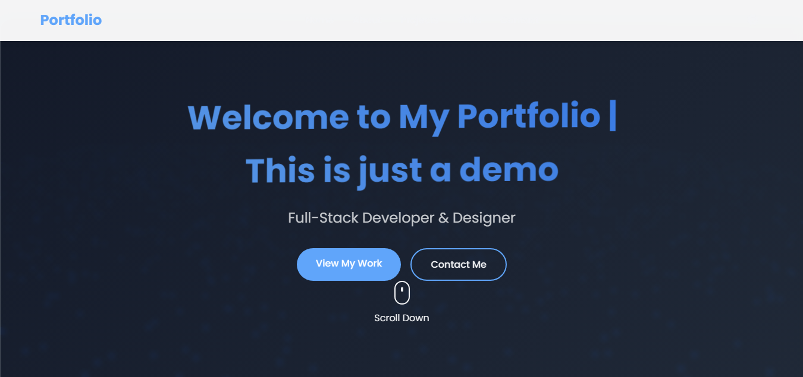

# Modern Portfolio Website

A stunning, responsive portfolio website featuring a 3D particle wave background, modern design, and smooth animations. Built with HTML5, CSS3, and JavaScript.



## Features

### 🎨 Modern Design
- Clean and professional layout
- Responsive design for all devices
- Glass morphism effects
- Dark/Light mode toggle

### 🌊 Interactive 3D Background
- Dynamic particle wave animation
- Responsive to window resizing
- Customizable particles (size, color, movement)
- Smooth motion effects

### 📱 Sections
- Hero section with animated text
- About section with statistics
- Projects showcase
- Skills visualization
- Contact form
- Social media links

### ✨ Animations
- Smooth page transitions
- Scroll reveal effects
- Hover animations
- Text glitch effects

## Project Structure
```
demo-portfolio/
├── index.html              # Main HTML file
├── css/
│   ├── style.css          # Main styles
│   └── animations.css      # Animation styles
├── js/
│   ├── main.js            # Core functionality
│   ├── animations.js      # Animation scripts
│   └── background.js      # 3D background
└── README.md              # Literally this file
```

## Customization

### Background Settings
In `js/background.js`, you can adjust:
```javascript
const waveSpeed = 0.001;    // Wave movement speed
const rotationSpeed = 0.0002; // Rotation speed
const waveHeight = 0.2;     // Wave height
```

### Color Scheme
In `css/style.css`, modify the root variables:
```css
:root {
    --primary-color: #2563eb;
    --secondary-color: #3b82f6;
    --background-color: rgba(255, 255, 255, 0.9);
    --text-color: #1f2937;
    /* ... other color variables */
}
```

### Content
1. **Personal Information**: Update text in `index.html`
2. **Projects**: Modify the projects array in `js/main.js`
3. **Skills**: Adjust skill levels in `js/main.js`
4. **Contact**: Update contact information in `index.html`

## Dependencies
- Three.js (v128) - 3D graphics
- Font Awesome (v6.4.0) - Icons
- Google Fonts (Poppins) - Typography

## Browser Support
- Chrome (recommended)
- Firefox
- Safari
- Edge

## Performance Optimization
- Lazy loading for images
- Optimized 3D rendering
- Smooth animations with requestAnimationFrame
- CSS transitions for better performance

## Customization Tips

### Adjusting Particle System
1. **Particle Count**: Modify the number in the loop
   ```javascript
   for (let i = 0; i < 5000; i++) // Change 5000 to desired amount
   ```

2. **Particle Size**: Adjust the size parameter
   ```javascript
   size: 6, // Change for larger/smaller particles
   ```

3. **Motion Speed**: Modify animation parameters
   ```javascript
   const waveSpeed = 0.001; // Lower = smoother, Higher = faster
   ```

### Adding New Sections
1. Create HTML structure
2. Add corresponding CSS styles
3. Include any necessary JavaScript functionality
4. Update navigation links

## Development
1. Clone the repository
2. Make desired changes
3. Test responsiveness across devices
4. Optimize images and assets
5. Deploy to your hosting service

## Credits
- Three.js for 3D graphics
- Font Awesome for icons
- Google Fonts for typography

## License
MIT License - feel free to use for your own portfolio!

---
Made with ❤️ by iakzs
